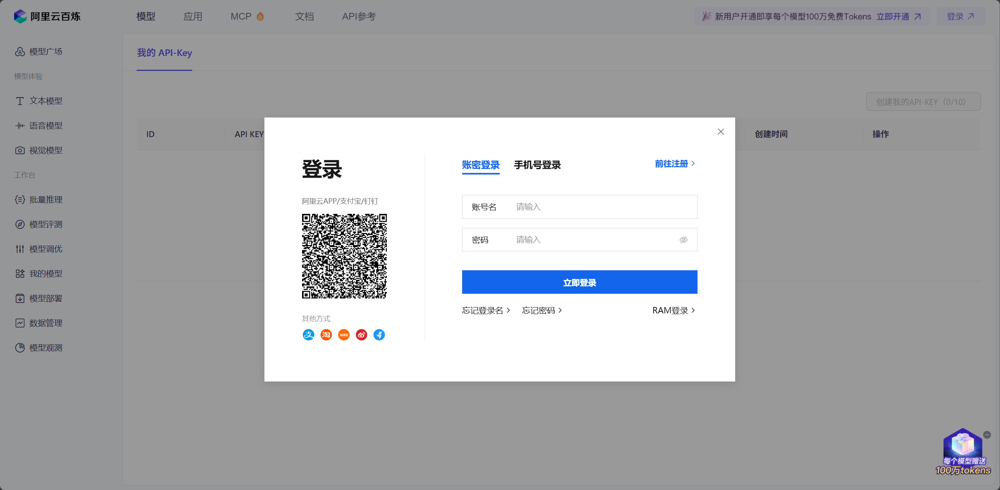
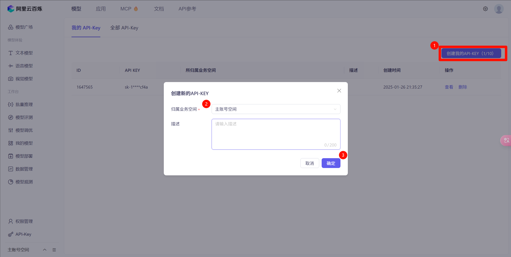
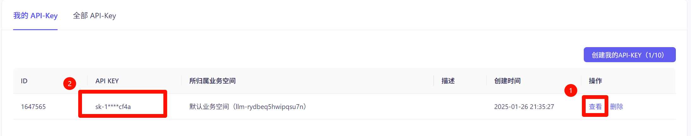
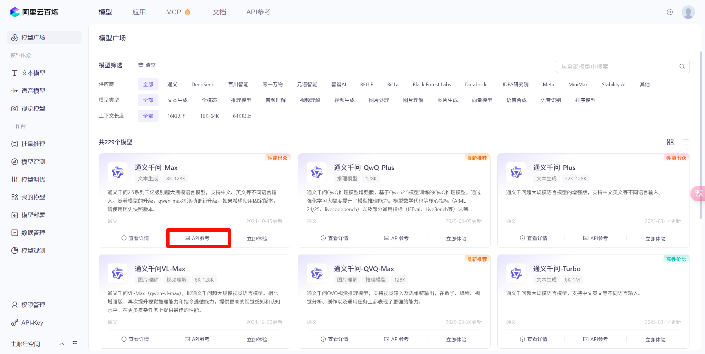
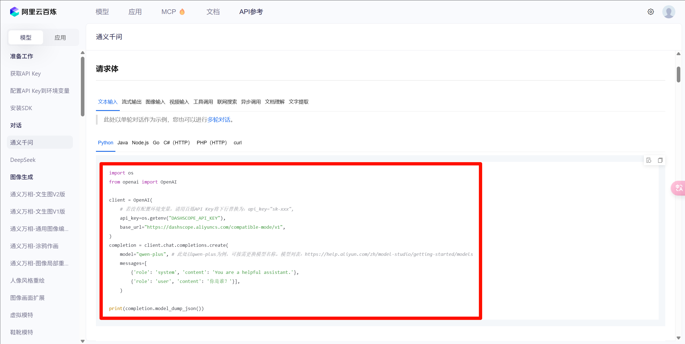

# 用代码与 LLM 交互 - 基础篇

> [!TIP]
>
> 本文使用 Python 进行讲解

想必绝大多数人已经尝试过在 App / 网页 中与 LLM 进行对话。但是这种交互方式毕竟是面向大众的，而非程序员。因此我们需要学习如何使用代码与 LLM 交互。

## 提示词

与 LLM 进行对话，首先要理解 LLM 的工作原理。本质上 LLM 就是这样一个算法：输入文本，然后输出文本，并且输入和输出遵循一定的格式。我们通常称“输入”为提示词（Prompt），“输出”为响应（Response）。

输入和输出通常遵循下面的格式：

```python
# 指 LLM 需要遵守的全局提示词，通常用来指明LLM需要遵循的各种要求和指令
系统提示词 = {
    "role": "user",
    "content": "系统提示词的内容"
}

# 指用户对LLM发送的聊天信息
用户提示词 = {
    "role": "user",
    "content": "用户提示词的内容"
}

LLM响应 = {
    "role": "assistant",
    "content": "LLM响应的内容"
}
```

在调用 LLM 时，我们会把这些提示词拼接成一个列表，同时传递给 LLM，并且调用完之后会返回一个单独的字典，包含 LLM 响应的内容。比如说：

```python
response = invoke_llm([
    {
        "role": "system",
        "content": "Always respond in Chinese"
    },
    {
        "role": "user",
        "content": "Hello! My name is Mike. How are you?"
    }
])

print(response)

"""
response = {
    "role": "assistant",
    "content": "你好！我很好，你怎么样？"
}
"""
```

实际上，输入的提示词数量可以有任意多条。我们在App中使用LLM能够实现多轮对话，即LLM能够记住上下文，实际上就是在输入中包含了前面所有的数据。比如说在下面这个例子中：

```markdown
User: Hello! My name is Mike. How are you?

Assistant: Hi! Nice to meet you Mike. I'm fine.

User: Who am I?

Assistant: You're Mike.
```

很显然在第二次对话中，LLM“记住”了上一次用户说的信息。在代码中，实际上就是这么调用的：

```python
invoke_llm([
    {
        "role": "user",
        "content": "Hello! My name is Mike. How are you?"
    },
    {
        "role": "assistant",
        "content": "Hi! Nice to meet you Mike. I'm fine."
    },
    {
        "role": "user",
        "content": "Who am I?"
    },
])
```

这就是多轮对话的原理。LLM本身不具有任何“记忆”的功能，它所有的表现都是基于用户提供的提示词实现的。

## LLM 平台

我们已经大致知道怎么调用 LLM 了，接下来就是要选择 LLM 服务的提供商了。通常来说分为两种：云端和本地。

### 本地

本地的优势有隐私安全、免费、自由度高等，但是通常需要一定的性能需求（比如足够强的显卡），因此并不是首要推荐。

有两种选择：

- Ollama: 提供命令行（终端）和后端服务，来和大模型进行交互。
- LM Studio: 完整的桌面软件，可以很方便的下载各种模型并进行聊天。

### 云端

通常需要到对应的提供商那里注册账号，并注册 API Key（一种密钥，让提供商知道是谁在使用他们的服务，用来进行认证）。

这里我们可以来看一下**阿里云百炼平台**的使用。

1. [打开链接](https://bailian.console.aliyun.com/?tab=model#/api-key)，注册账号并登录。



2. 创建 API Key



3. 点击“查看”，然后复制 API Key，并保存下来。



4. 来到[模型广场](https://bailian.console.aliyun.com/?tab=model#/model-market)，选择一个喜欢的模型，点击“API参考”



5. 往下翻，找到Python代码的示例，根据示例进行模型调用即可



## 在 Python 中调用 LLM

我们使用 “openai” 库来调用前面配置好的阿里云百炼上的模型。

1. 安装库

```bash
pip install openai
```

2. 编写代码（api_key填自己的，model填想要的模型名，messages填前面说的提示词）

```python
from openai import OpenAI

client = OpenAI(
    api_key="sk-xxx",
    base_url="https://dashscope.aliyuncs.com/compatible-mode/v1",
)

completion = client.chat.completions.create(
    model="qwen-turbo",
    messages=[
        {"role": "system", "content": "You are a helpful assistant."},
        {"role": "user", "content": "你是谁？"},
    ],
)

print(completion.model_dump_json())
```

3. 运行，查看效果（输出结果已格式化）

```json
{
    "id": "chatcmpl-3f502d8c-5fd8-916b-88b1-aef25596237d",
    "choices": [
        {
            "finish_reason": "stop",
            "index": 0,
            "logprobs": null,
            "message": {
                "content": "我是通义千问，阿里巴巴 集团旗下的超大规模语言模型。我能够帮助你回答问题、创作文字，如写故事、公文、技术文档等，还能进行逻辑推理，表达观点，玩游戏等。如果你有任何问题或需要帮助，欢迎随时告诉我！",
                "refusal": null,
                "role": "assistant",
                "annotations": null,
                "audio": null,
                "function_call": null,
                "tool_calls": null
            }
        }
    ],
    "created": 1744420816,
    "model": "qwen-turbo",
    "object": "chat.completion",
    "service_tier": null,
    "system_fingerprint": null,
    "usage": {
        "completion_tokens": 57,
        "prompt_tokens": 22,
        "total_tokens": 79,
        "completion_tokens_details": null,
        "prompt_tokens_details": null
    }
}
```