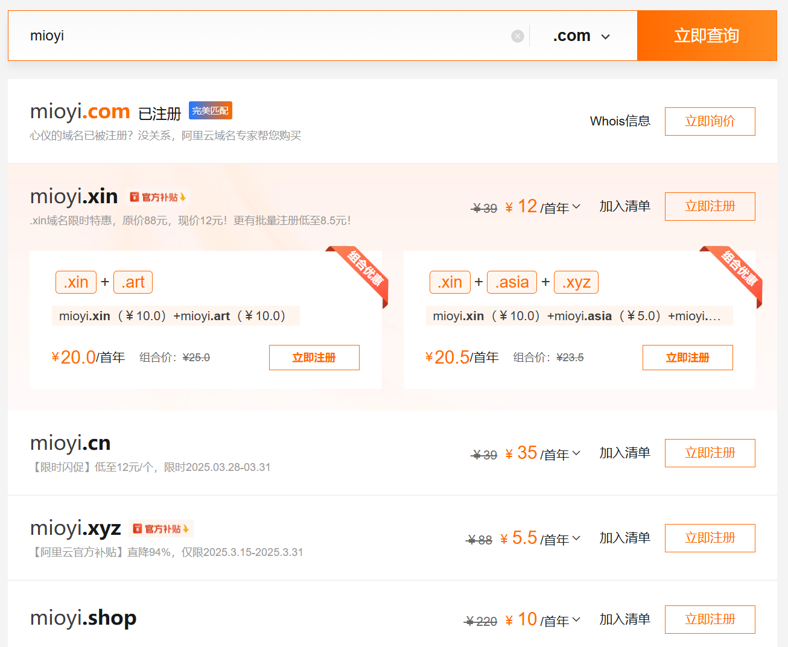
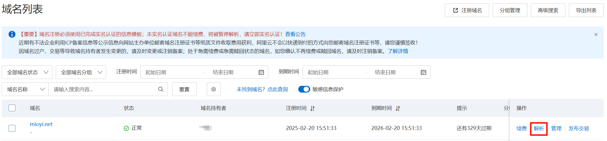

# 上云教程

[[toc]]

## 云厂商选择

国内：

- 阿里云
- 腾讯云

国外：

- Google Cloud
- Azure (Microsoft)
- AWS/Amazon Web Service (Amazon)

> 下文以阿里云为例进行讲解

## 云服务器

云服务器就是云服务厂商提供的服务器，而服务器就是为其他计算机提供服务的机器。通常我们选择使用 Linux 作为服务器的操作系统。

### 购买

打开[链接](https://ecs-buy.aliyun.com/ecs)

1. 选择付费类型（包年包月/按量付费）。后者通常按小时计费。
1. 选择地域。若选择中国内地（如杭州），则后续想要使用域名，必须要备案（较为麻烦）。若不喜欢备案，可以选择中国香港。
1. 选择实例。主要关注 CPU 核心数和内存数。为了权衡价格和性能，推荐 2 核 2G 的实例（1 核会非常卡；4G 内存太贵）
1. 选择镜像。我们通常会选择基本的操作系统的镜像。这里我推荐 Debian（相比 Ubuntu 更为轻量、稳定）和 Alibaba Cloud Linux（稳定、有官方支持）。
1. 选择系统盘容量（默认 40G 基本够用）
1. 选择带宽计费模式和带宽值。计费模式分为按带宽和按总流量。前者不限制总流量数，只限制最高网速，后者相反。流量不大的情况下后者会更实惠。
1. 开放端口，勾选 HTTP 和 HTTPS
1. 选择“登录凭证”，新手建议使用“自定义密码”，登录名建议选 ecs-user（较为安全）
1. 点击“立即下单”

## 域名

用 IP 来访问服务器，既不美观也不好记忆，因此就出现了域名。**域名**（Domain）可以看作是给 IP 起的一个别名。比如 `baidu.com` 就对应了 `39.156.66.10` 这个 IP。

### 购买

打开[链接](https://wanwang.aliyun.com/domain)

1. 输入一个想要的名字，并选择一个后缀（顶级域名），然后点击查询

2. 如果未被注册，则点击“立即注册”，然后进行购买；否则请更换顶级域名

3. 购买完成后，打开[域名控制台](https://dc.console.aliyun.com/next/index#/domain-list/all)，选择“解析”

4. 添加解析记录。详细解释请看右边的说明

## HTTPS

HTTPS 为 HTTP 的安全版本，通过 TLS/SSL 技术进行数据加密。HTTPS 一般需要有一个证书，该证书可以自己签发，也可以由经授权的公司签发，但是自己签发的证书是无法被浏览器信任的，因此需要选择后者。但是后者的购买售价极其高昂。不过 Let's Encrypt 提供了免费的证书，让这件事不再难以触及。

## Cloudflare

Cloudflare 提供了 HTTPS（免费）、DNS 解析（免费）、DDOS 防护（部分免费）和 CDN（部分免费）等功能，被大多数人调侃为“赛博菩萨”。其中 HTTPS 的配置也非常灵活：

有兴趣的可以自行研究怎么使用 Cloudflare
